# 基于springboot的疫苗发布和接种预约系统

---
### 👉作者QQ ：1556708905 微信：zheng0123Long (支持定制修改、部署调试、定制毕设)

### 👉接网站建设、小程序、H5、APP、各种系统等

---

#### 介绍

在公共卫生领域，疫苗的及时接种对于预防疾病传播和保障公众健康至关重要。为了提高疫苗接种的效率和便利性，我们开发了这个基于 Spring Boot 的疫苗发布和接种预约系统。该系统旨在为管理端、医生端和用户端提供一体化的服务，实现疫苗信息的准确发布、接种预约的便捷操作以及相关管理工作的高效执行。

#### 技术栈

后端技术栈：Springboot+Mysql+Maven

前端技术栈：Vue+Html+Css+Javascript+ElementUI

开发工具：Idea+Vscode+Navicate

#### 系统功能介绍

（一）管理端  
个人中心：管理端工作人员可以在个人中心查看和修改个人信息，以及系统操作记录和通知。  
管理员管理：对系统中的其他管理员进行添加、删除、修改以及权限分配，确保管理团队的合理配置和职责明确。  
基础数据管理：维护系统运行所需的基础数据，如疫苗种类、接种禁忌、接种年龄段等。  
论坛管理：监督论坛的交流内容，处理违规言论，确保论坛交流环境的健康与有序。  
公告信息管理：发布和管理与疫苗相关的公告信息，如疫苗到货通知、接种点变更、临时接种安排等。  
疫苗信息管理：全面管理疫苗的详细信息，包括疫苗名称、生产厂家、批次、有效期、适用人群等。  
医生管理：对医生的账号进行创建、审核、信息修改以及权限设置，监督医生的工作情况。  
医院信息管理：登记和管理合作医院的信息，包括医院名称、地址、联系电话、接种时间等。  
用户管理：管理用户的注册信息、个人资料、接种记录等，保障用户数据的安全和准确性。  
预约接种管理：处理用户的预约申请，进行预约安排、调整和取消，确保接种流程的顺畅。  
轮播图信息管理：负责轮播图的内容更新和展示顺序调整，突出重要的疫苗信息和接种通知。  

（二）医生端  
论坛：参与论坛交流，分享疫苗接种的经验和知识，解答用户的疑问。  
公告信息：及时获取系统发布的公告信息，了解疫苗接种的最新政策和工作安排。  
疫苗信息：查看疫苗的详细资料，掌握疫苗的库存情况和使用说明。  
医院信息：了解所在医院的工作安排、接种点设置和服务时间等。  
个人中心：查看和修改个人信息，查看工作任务和绩效记录。  
后台管理  
论坛管理：对自己在论坛发布的内容进行编辑和删除，回复用户的咨询和评论。  
公告信息管理：查看与自身工作相关的公告信息，确保工作的合规和及时响应。  
疫苗信息管理：更新疫苗的库存数量、接种情况等信息。  
医院信息管理：协助维护医院的信息，如临时调整接种时间等。  
预约接种管理：查看用户的预约记录，为接种做好准备工作。  

（三）用户端  
论坛：在论坛中与其他用户交流疫苗接种的感受和经验，向医生咨询问题。  
公告信息：获取最新的疫苗公告，了解疫苗供应和接种政策的变化。  
疫苗信息：查询各类疫苗的详细介绍，包括功效、副作用、接种注意事项等。  
医院信息：查找附近的接种医院和接种点，了解其地址、联系方式和服务时间。  
个人中心：管理个人资料，查看自己的接种历史和预约记录。  
后台管理  
论坛管理：发布自己的问题和见解，管理自己在论坛的发言。  
公告信息管理：标记已读和重要的公告信息，方便后续查阅。  
疫苗信息管理：关注特定疫苗的信息更新。  
医院信息管理：收藏常去的接种医院或接种点，方便快速查找。  
预约接种管理：进行疫苗接种的预约、取消或修改预约时间。  

#### 系统作用

提高疫苗接种效率  
简化预约流程，减少用户排队等待时间，提高接种点的工作效率。  
保障信息准确性  
及时、准确地发布疫苗信息，避免用户因信息不准确而产生误解或延误接种。  
优化资源配置  
合理安排接种资源，根据预约情况进行疫苗调配和人员安排。  
增强公众参与度  
提供论坛交流平台，促进公众对疫苗接种的了解和参与，提高疫苗接种的覆盖率。  
提升管理水平  
为管理部门和医疗机构提供全面的数据分析和管理工具，有助于制定科学的疫苗接种策略。  

#### 系统功能截图

代码结构

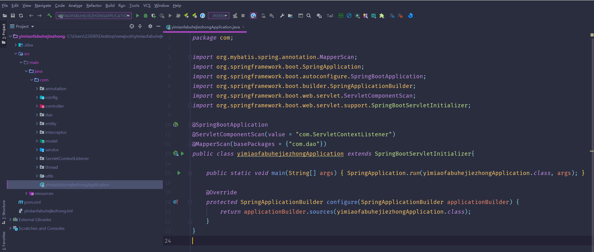

数据库表

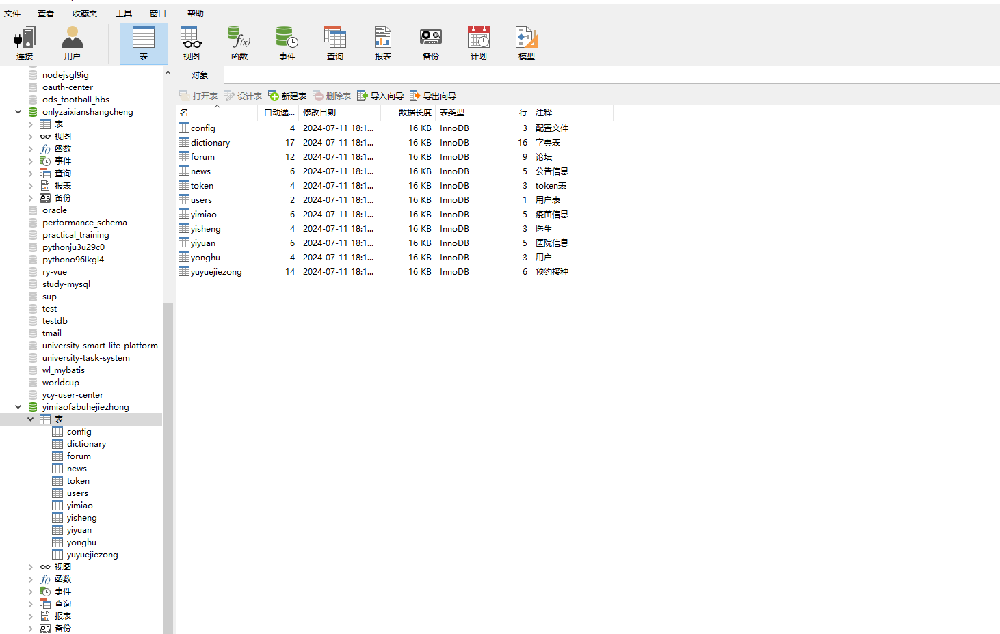

登录

前台页面首页

论坛

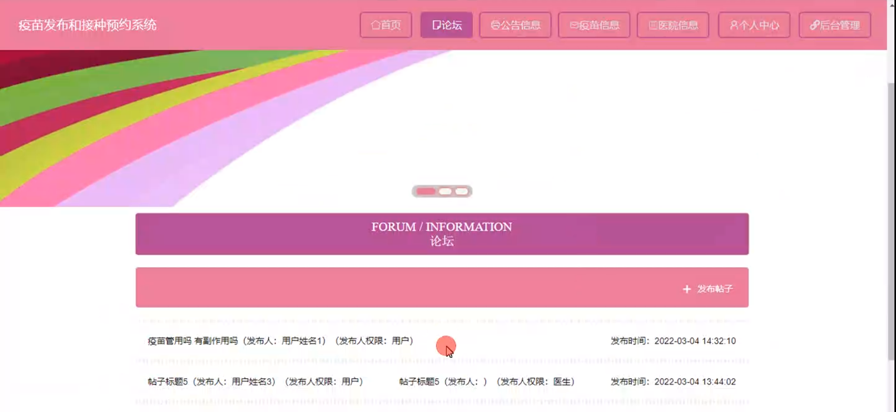

公告信息

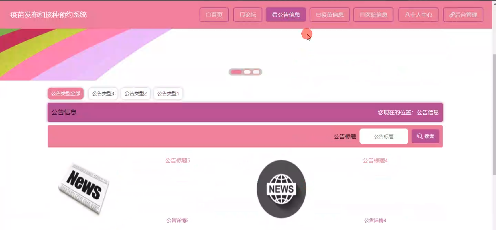

医院信息

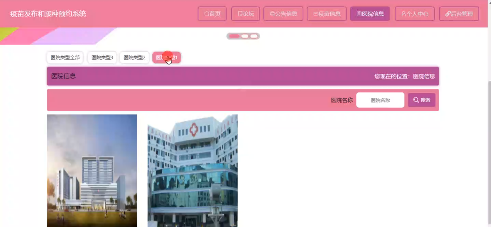

个人中心

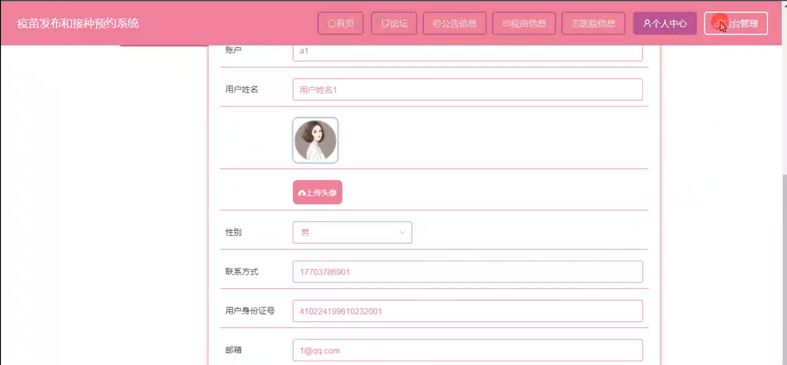

管理员管理

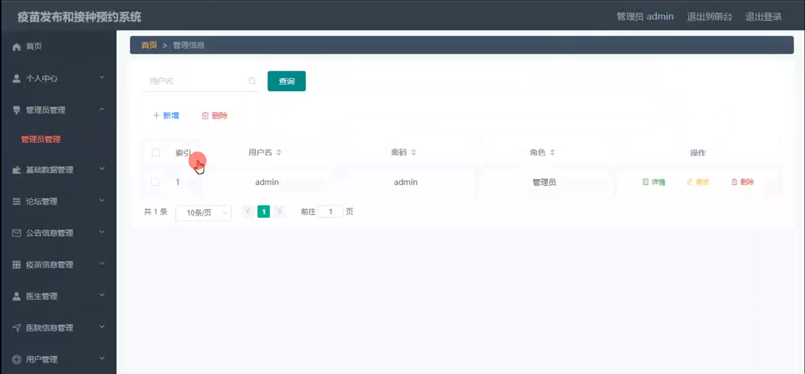

疫苗信息管理

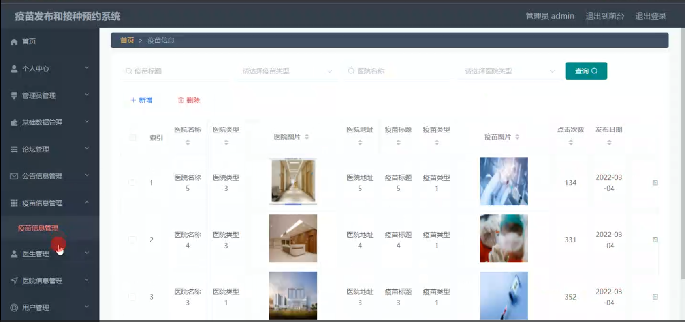

用户管理

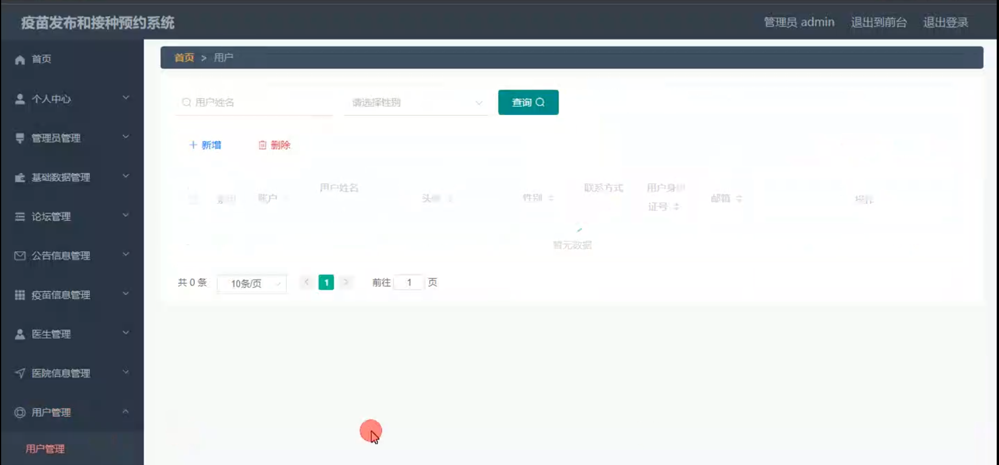

预约接种管理

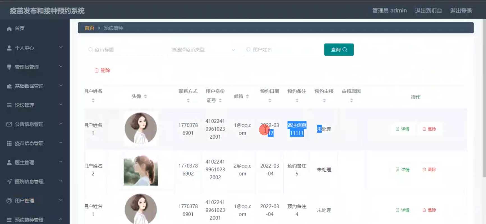

轮播图信息管理

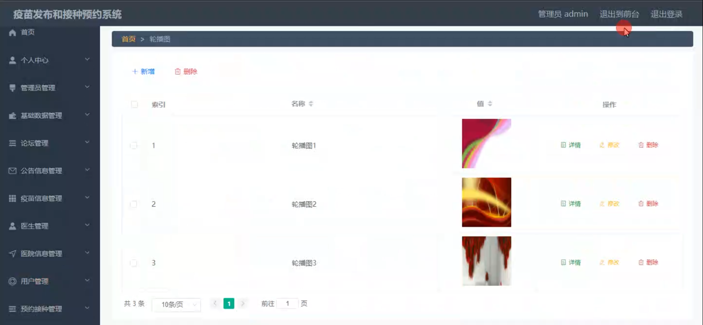

医生端帖子回复

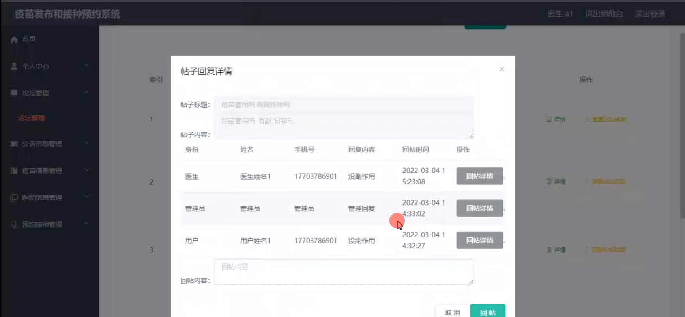

医院信息管理

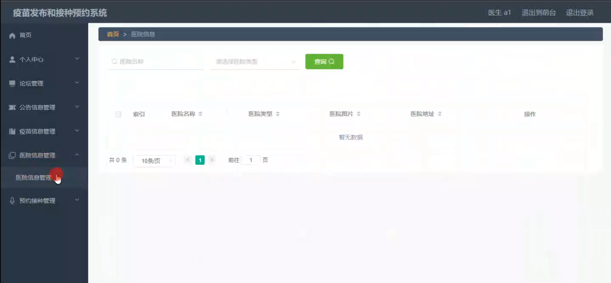

用户端个人信息

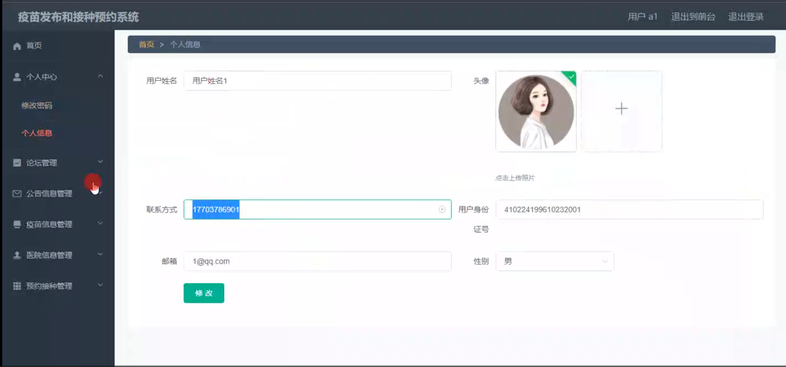

#### 总结

基于 Spring Boot 的疫苗发布和接种预约系统，通过明确管理端、医生端和用户端的功能模块，实现了疫苗接种工作的信息化、规范化和高效化。该系统不仅方便了公众预约接种疫苗，也为医疗机构和管理部门提供了有力的支持，对于保障公众健康、预防疾病传播具有重要意义。

#### 使用说明

创建数据库，执行数据库脚本 修改jdbc数据库连接参数 下载安装maven依赖jar 启动idea中的springboot项目

前台登录页面
http://localhost:8080/yimiaofabuhejiezhong/front/index.html

后台登录页面
http://localhost:8080/yimiaofabuhejiezhong/admin/dist/index.html

管理员				账户:admin 		密码：admin

医生				账户:a1 		密码：123456

用户				账户:a1 		密码：123456